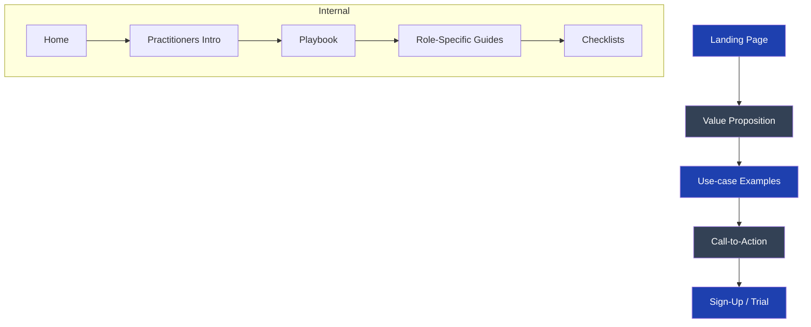

## High‑Level User Flow

```mermaid
flowchart TD
    A[Landing Page] --> B[Value Proposition]
    B --> C[Use‑case Examples]
    C --> D[Call‑to‑Action]
    D --> E[Sign‑Up / Trial]
    
    subgraph Internal
        I1[Home]
        I2[Practitioners Intro]
        I3[Playbook]
        I4[Role‑Specific Guides]
        I5[Checklists]
    end
    
    I1 --> I2 --> I3 --> I4 --> I5
    
    style A fill:#1e40af,color:#fff
    style B fill:#334155,color:#fff
    style C fill:#1e40af,color:#fff
    style D fill:#334155,color:#fff
    style E fill:#1e40af,color:#fff
```

*The diagram outlines the core journey for external visitors (top) and the internal practitioner path (bottom).*
